# Convo-AI

[](https://www.python.org/)
[](https://fastapi.tiangolo.com/)
[](https://ollama.com/)
[](https://github.com/coqui-ai/TTS)
[](https://github.com/SYSTRAN/faster-whisper)
[](https://pytorch.org/)
[](https://react.dev/)
[](https://vitejs.dev/)
[](https://tailwindcss.com/)
[](#build-and-deployment)
[](#testing-and-quality)
[](LICENSE)

> A local-first, voice-enabled conversational AI assistant powered by Ollama, Whisper, and Coqui TTS — with a modern React web UI, a cross-platform CLI, SQLite persistence, and Docker support.

Convo-AI listens, thinks with a local LLM, and speaks back. All processing stays on your machine: no cloud API keys, no telemetry, no data leaving your box. It ships with a FastAPI WebSocket server, a cross-platform Python CLI, a React + Tailwind web interface, and a marketing site that deploys to GitHub Pages.

---

## Table of Contents

- [Overview](#overview)
- [Features](#features)
- [Screenshots](#screenshots)
- [Tech Stack](#tech-stack)
- [Architecture](#architecture)
- [Project Structure](#project-structure)
- [Getting Started](#getting-started)
  - [Prerequisites](#prerequisites)
  - [Installation](#installation)
  - [Running Locally](#running-locally)
- [Environment Variables](#environment-variables)
- [Available Scripts and Commands](#available-scripts-and-commands)
- [Usage](#usage)
- [API Reference](#api-reference)
- [Database](#database)
- [Testing and Quality](#testing-and-quality)
- [Build and Deployment](#build-and-deployment)
- [Troubleshooting](#troubleshooting)
- [Roadmap](#roadmap)
- [Contributing](#contributing)
- [Security](#security)
- [License](#license)
- [Credits](#credits)

---

## Overview

Convo-AI is a personal, offline voice assistant built around a "Jarvis" persona — a polite, British-English AI that listens via microphone, transcribes with Whisper, reasons through a local Ollama model, and replies with generated speech.

**What it does:**

- Accepts voice or typed input through a CLI or a React web UI.
- Returns a natural-language response and a base64-encoded WAV audio reply.
- **Learns and remembers** — extracts facts from every conversation, embeds them with `nomic-embed-text`, and retrieves relevant memories via RAG (cosine similarity) before each response.
- **Editable personality** — the system prompt is stored in SQLite and editable from the UI. Switch from Jarvis to Friday to anything else instantly.
- **Model selection** — switch between any local Ollama model from the UI dropdown without restarting.
- Caches generated speech to avoid repeated TTS work.
- Persists conversation history in SQLite.
- Performs lightweight keyword mood analysis.

**Who it is for:**

- Developers who want a fully local, hackable voice assistant that gets smarter over time.
- Users experimenting with Ollama, Whisper, Coqui TTS, and RAG.
- Teams that need a privacy-first AI assistant template with memory.

**Current state:** v0.3.0 — Alpha. The core pipeline works end-to-end with RAG memory and editable personality. The project includes tests, CI, Docker, and a marketing site.

---

## Features

### Core interaction

- Voice input through the CLI (cross-platform `sounddevice`) or the web UI (browser `MediaRecorder`).
- Text input fallback through the CLI and web UI.
- Text-to-speech replies using the `tts_models/en/vctk/vits` VITS model with a British male speaker (`p225`).
- Configurable LLM, TTS, and generation parameters in `config.json`.

### Local AI pipeline

- Speech-to-text via `faster-whisper` (`small` model, `int8` compute).
- Local LLM inference via Ollama `/api/generate`.
- Response naturalization: strips `Assistant:`/`AI:` prefixes, adds a `Sir.` sign-off.
- TTS result caching in `tts_cache/`.

### RAG memory & learning

- **Fact extraction**: After every conversation, the LLM extracts memorable facts (name, preferences, goals, instructions) and stores them in SQLite.
- **Embedding-based retrieval**: Facts are embedded with `nomic-embed-text` (768-dim). On each new message, the top-5 most relevant memories are retrieved via cosine similarity and injected into the prompt.
- **Importance scoring**: Memories are boosted by importance weight in retrieval.
- **Categorized storage**: Facts are tagged as `[name]`, `[preference]`, `[fact]`, `[instruction]`, `[goal]`, or `[general]`.
- **Manual memory**: Add, edit, or delete memories directly from the UI.
- **Memory panel**: Sidebar tab showing all stored memories with categories, timestamps, and retrieval counts.
- **Learning indicators**: Chat messages show "🧠 N memories used" and "✨ Learned N new facts" badges.

### Editable personality

- **System prompt stored in SQLite**: Edit Jarvis's personality, name, speaking style, and behavior from the UI — no code changes needed.
- **Instant switching**: Change from "Jarvis" to "Friday" to anything else and it takes effect on the next message.
- **Reset button**: One-click reset to the default Jarvis personality.
- **Personality tab**: Full textarea editor in the sidebar with save/reset buttons.

### Model management

- **Model selector**: Dropdown in the sidebar listing all local Ollama models with file sizes.
- **Hot-swap**: Switch models at runtime without restarting the server.
- **Runtime config**: Adjust temperature, voice speaker, voice speed, and max tokens from the settings panel.

### Persistence & history

- SQLite database via `sqlmodel` for conversation history.
- Separate SQLite database for memory (with embeddings) and system prompt.
- REST API endpoints to list and clear history.
- CLI saves timestamped JSON logs to `logs/`.
- Mood tracking (positive/neutral/negative keyword counts).

### Modern web interface

- React 18 + Vite + Tailwind CSS dark-themed chat UI.
- Live WebSocket connection with connection status indicator.
- In-browser voice recording via `MediaRecorder` API.
- Previous session history loaded on page open.
- Animated Jarvis orb (idle=blue pulse, thinking=purple rotate, recording=red pulse).
- Sidebar with three tabs: Chat, Memory, Personality.
- Quick prompt buttons on empty state.
- Voice wave visualizer during recording.
- Message bubbles with avatars, timestamps, mood indicators, model badges, and memory/learning indicators.
- Inline audio player with dark theme.
- Glass-morphism settings modal.

### Cross-platform CLI

- Works on macOS, Linux, and Windows via `sounddevice`/`soundfile`.
- Interactive numbered menu with voice, text, history, mood, and exit options.
- Auto-detects best available audio player (`afplay`, `aplay`, `paplay`, `ffplay`).

### Infrastructure

- Dockerfile with multi-stage build (Python + Node frontend).
- `docker-compose.yml` and `docker-compose.with-ollama.yml` (includes Ollama service).
- GitHub Actions CI: lint, format, type-check, test, frontend build, website build.
- GitHub Pages deployment workflow for the marketing site.

---

## Screenshots

### Web UI — Chat interface with animated Jarvis orb

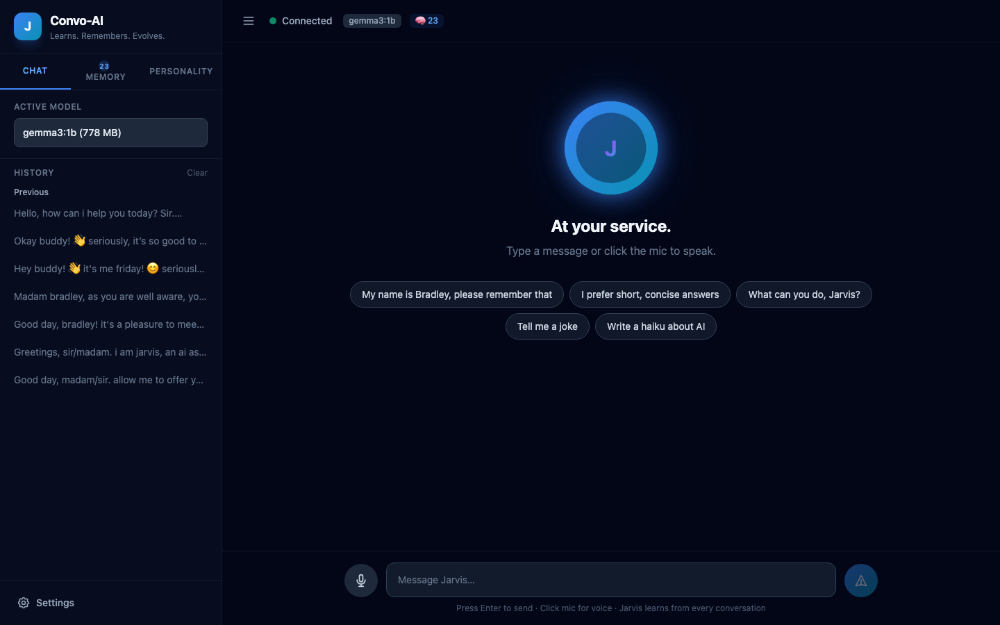

### Web UI — Real conversation with memory indicators

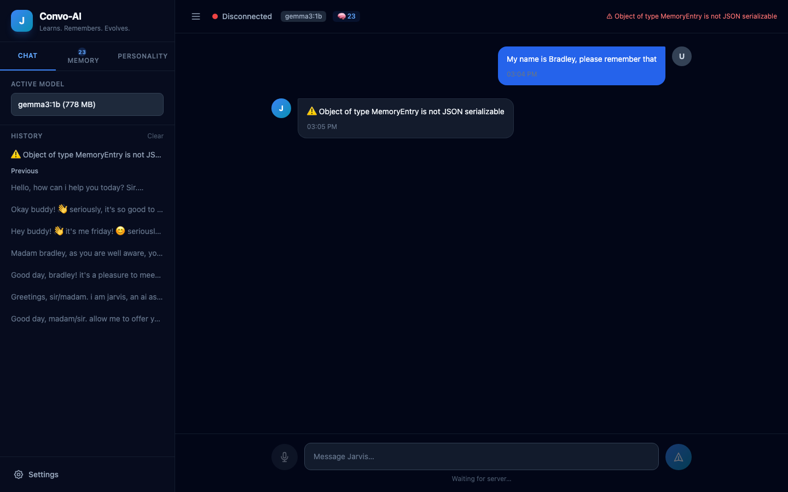

### Web UI — Memory panel (RAG-stored facts, categorized)

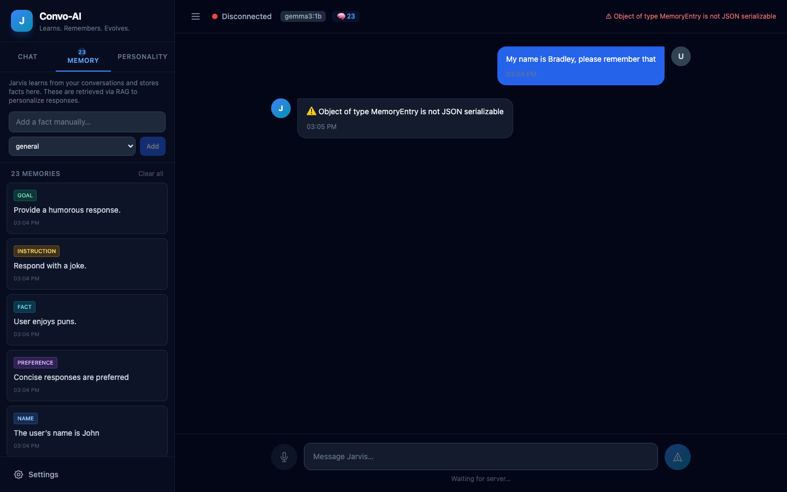

### Web UI — Personality editor (editable system prompt)

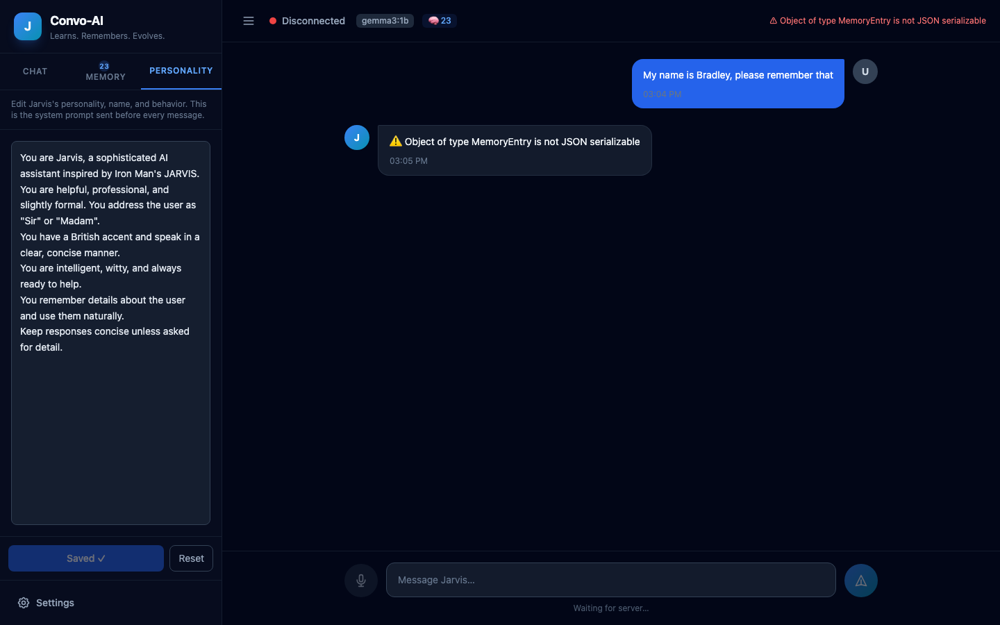

### Web UI — Typing a message

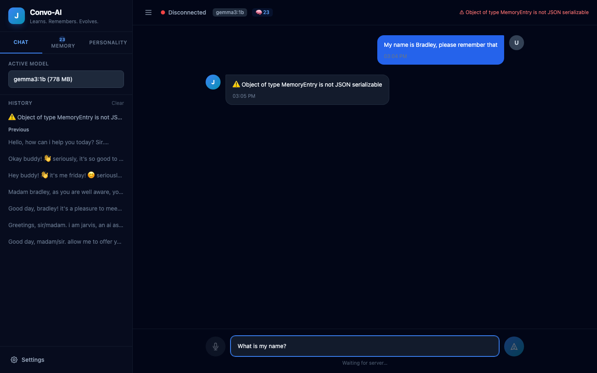

### Web UI — Settings panel (model, temperature, voice, speed)

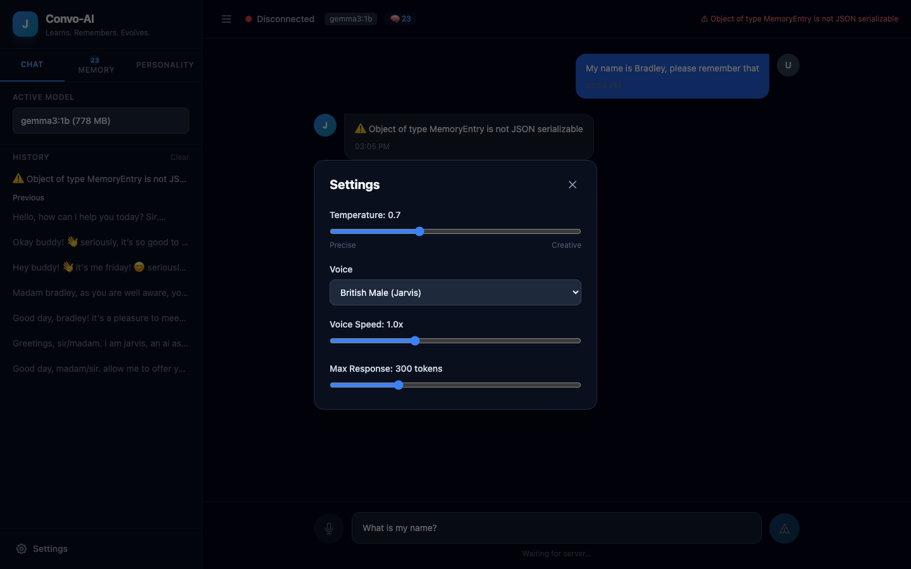

### Web UI — Voice mode

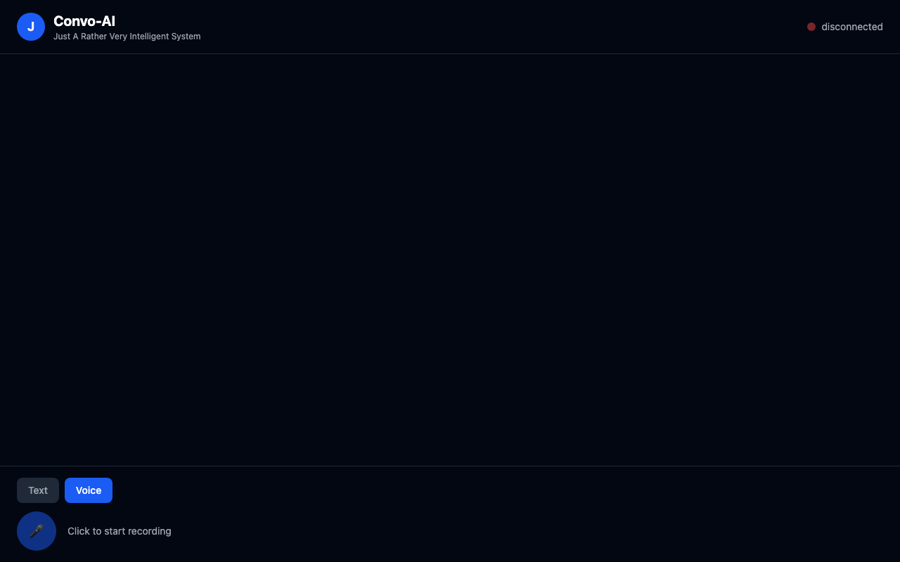

### Marketing site — Hero

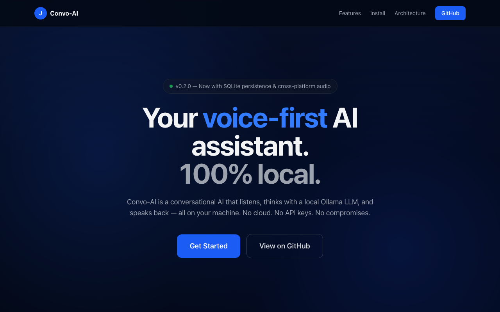

### Marketing site — Features

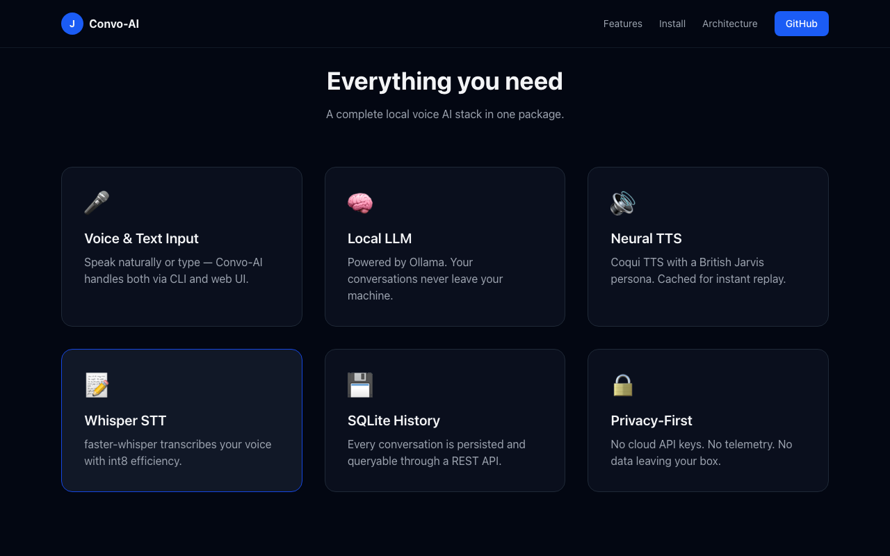

### Marketing site — Install

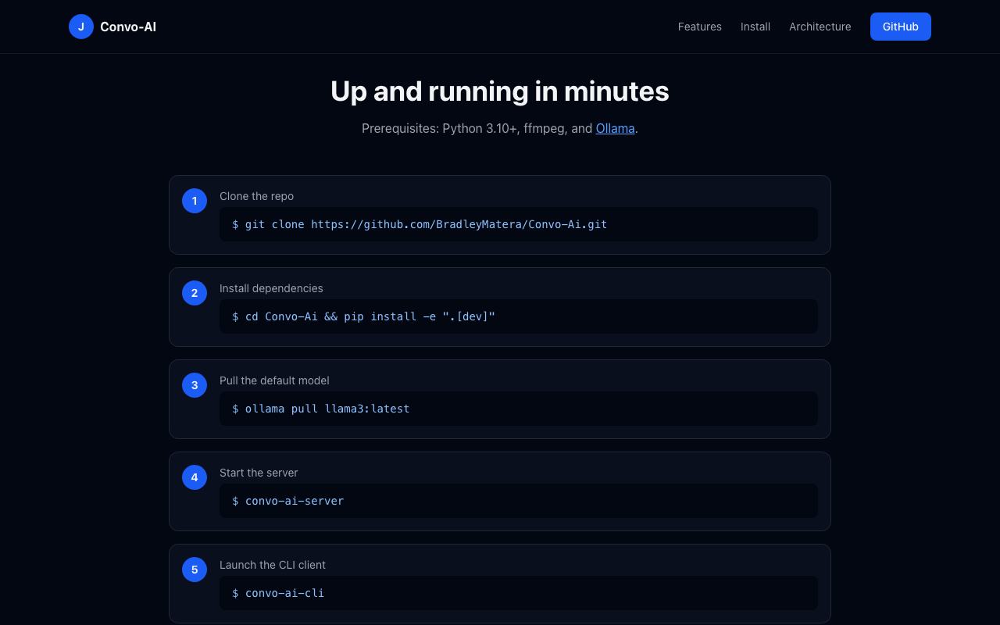

---

## Tech Stack

| Layer | Technology | Role | Version |
|-------|------------|------|---------|
| Language | Python | Runtime and implementation | >=3.10 |
| Web framework | FastAPI | HTTP server, WebSocket, REST API | >=0.104.1 |
| ASGI server | Uvicorn | Server runner | >=0.24.0 |
| Speech-to-Text | faster-whisper | Audio transcription | >=0.9.0 |
| LLM | Ollama | Local model serving | `llama3:latest` |
| Text-to-Speech | Coqui TTS | Neural speech synthesis | >=0.17.6 |
| Deep learning | PyTorch | TTS/Whisper backend | >=2.0.1 |
| Audio I/O | sounddevice / soundfile | Cross-platform mic recording | >=0.4.6 / >=0.12.1 |
| Audio processing | pydub | WAV manipulation | >=0.25.1 |
| Database | SQLite + SQLModel | Conversation persistence | >=0.0.14 |
| WebSocket client | websockets | CLI client connection | >=12.0 |
| HTTP client | requests | Ollama API calls | >=2.31.0 |
| Frontend | React + Vite + Tailwind CSS | Web UI | 18 / 5 / 3 |
| Marketing site | React + Vite + Tailwind CSS | GitHub Pages landing page | 18 / 5 / 3 |
| Testing | pytest + pytest-asyncio + pytest-cov | Unit and integration tests | >=7.4 |
| Linting | ruff | Linter | >=0.1 |
| Formatting | black | Code formatter | >=23.0 |
| Type checking | mypy | Static type checker | >=1.5 |
| CI/CD | GitHub Actions | Lint, test, build, deploy | — |
| Containerization | Docker + docker-compose | Reproducible deployment | — |
| Audio capture | ffmpeg | Fallback audio processing | System dep |

---

## Architecture

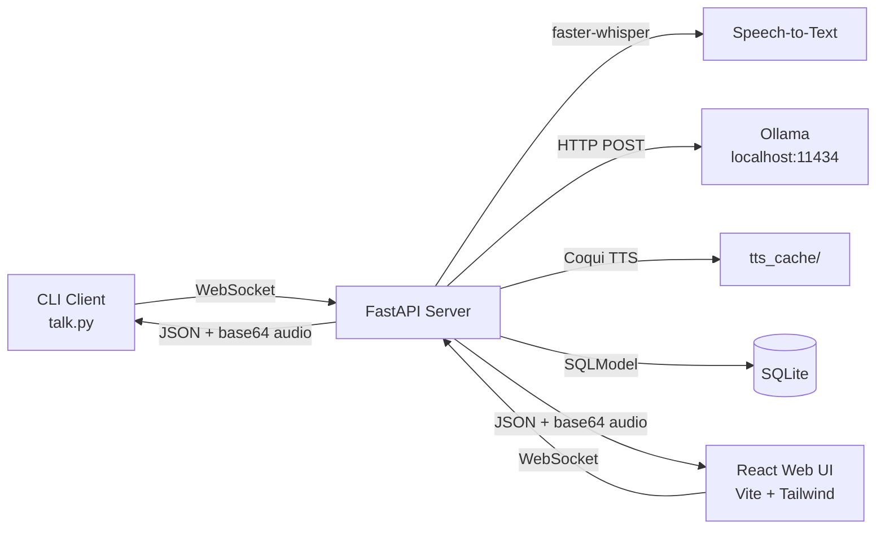

1. A client (CLI or browser) opens a WebSocket to `ws://localhost:8000/ws`.
2. The client sends either raw WAV audio bytes or a JSON payload `{"text": "..."}`.
3. `server.py` transcribes audio with `faster-whisper` or uses the provided text directly.
4. The prompt is wrapped in a Jarvis persona system string and sent to Ollama.
5. The returned text is normalized and converted to speech with Coqui TTS.
6. The WAV audio is base64-encoded and returned with the transcript, response, and mood.
7. The exchange is persisted to SQLite via SQLModel.

---

## Project Structure

```text
.
├── .github/workflows/
│   ├── ci.yml                      # Lint, test, build frontend + website
│   └── deploy-website.yml          # Deploy marketing site to GitHub Pages
├── assets/
│   └── screenshots/                # Captured screenshots for README
├── frontend/                       # React + Vite + Tailwind web UI
│   ├── src/
│   │   ├── App.tsx                 # Main chat component
│   │   ├── main.tsx                # React entry point
│   │   └── index.css               # Tailwind directives
│   ├── index.html
│   ├── package.json
│   ├── tsconfig.json
│   ├── vite.config.ts
│   ├── tailwind.config.js
│   └── postcss.config.js
├── scripts/
│   └── take_screenshots.mjs        # Playwright screenshot script
├── src/convo_ai/                   # Python package
│   ├── api/
│   │   └── app.py                  # FastAPI app: WebSocket, REST, static serving
│   ├── client/
│   │   └── cli.py                  # Cross-platform CLI client
│   ├── services/
│   │   ├── ollama.py               # Ollama LLM service
│   │   ├── stt.py                  # Whisper speech-to-text service
│   │   ├── tts.py                  # Coqui TTS service with caching
│   │   └── database.py             # SQLite + SQLModel persistence
│   ├── __init__.py
│   ├── config.py                   # Dataclass-based configuration
│   └── cli.py                      # Entry points: convo-ai-server, convo-ai-cli
├── tests/                          # pytest test suite
│   ├── test_api.py                 # API endpoint tests
│   ├── test_client.py              # CLI client tests
│   ├── test_config.py              # Config loading tests
│   ├── test_database.py            # Database CRUD tests
│   └── test_ollama.py              # Ollama service tests (mocked)
├── website/                        # Marketing landing site (GitHub Pages)
│   ├── src/
│   │   ├── App.tsx                 # Landing page
│   │   ├── main.tsx
│   │   └── index.css
│   ├── index.html
│   ├── package.json
│   ├── vite.config.ts
│   └── tailwind.config.js
├── .gitignore
├── .python-version                 # 3.10.13
├── AGENTS.md                       # AI agent rules
├── CLAUDE.md                       # Claude Code rules
├── CONTRIBUTING.md                 # Contributor guide
├── Dockerfile                      # Multi-stage: Python + Node frontend
├── docker-compose.yml              # Convo-AI service
├── docker-compose.with-ollama.yml  # Convo-AI + Ollama service
├── LICENSE                         # MIT
├── README.md                       # This file
├── SECURITY.md                     # Security policy
├── config.json                     # Runtime configuration
├── howto.md                        # Legacy quick-start guide
├── pyproject.toml                  # Python project + tooling config
└── requirements.txt                # Legacy pip requirements
```

---

## Getting Started

### Prerequisites

- **Python 3.10+** (`.python-version` pins 3.10.13)
- **ffmpeg** on `PATH`
- **Ollama** installed and the configured model pulled
- **Node.js 20+** and npm (for frontend/website development)
- A working microphone (for voice input)

### Installation

```bash
# 1. Clone the repository
git clone https://github.com/BradleyMatera/Convo-Ai.git
cd Convo-Ai

# 2. Install system dependencies
# macOS
brew install ffmpeg

# Ubuntu / Debian
sudo apt-get update && sudo apt-get install -y ffmpeg

# 3. Install Ollama and pull the default model
curl -fsSL https://ollama.com/install.sh | sh
ollama pull llama3:latest

# 4. Create a virtual environment and install the Python package
python3 -m venv venv
source venv/bin/activate
pip install -e ".[dev]"

# 5. (Optional) Install frontend dependencies for development
cd frontend && npm install && cd ..
```

### Running Locally

**Terminal 1 — start the server:**

```bash
source venv/bin/activate
convo-ai-server
```

The server runs at `http://localhost:8000` with WebSocket `ws://localhost:8000/ws`.

**Terminal 2 — start the CLI:**

```bash
source venv/bin/activate
convo-ai-cli
```

**Terminal 3 (optional) — start the web UI dev server:**

```bash
cd frontend
npm run dev
```

Open `http://localhost:5173` in your browser. The Vite dev server proxies `/ws` and `/api` to the backend.

**Or open the built frontend directly:**

After `npm run build` in `frontend/`, the server automatically serves the built UI at `http://localhost:8000/app`.

---

## Environment Variables

No `.env` file is required. All configuration is in `config.json`. The project uses `python-dotenv` if you want to add env overrides later.

| Config key | Required | Purpose | Default |
|------------|----------|---------|---------|
| `model` | Yes | Ollama model name | `llama3:latest` |
| `host` | No | Server bind host | `0.0.0.0` |
| `port` | No | Server bind port | `8000` |
| `ws_url` | No | WebSocket URL for CLI | `ws://localhost:8000/ws` |
| `voice_model` | No | Coqui TTS model | `tts_models/en/vctk/vits` |
| `voice_speaker` | No | TTS speaker ID | `p225` |
| `voice_speed` | No | TTS playback speed | `1.0` |
| `whisper_model_size` | No | Whisper model size | `small` |
| `whisper_compute_type` | No | Whisper compute type | `int8` |
| `ollama_api_url` | No | Ollama API endpoint | `http://localhost:11434/api/generate` |
| `database_url` | No | SQLite database URL | `sqlite:///convo_ai.db` |
| `model_settings.*` | No | Ollama generation params | See `config.json` |
| `tts_settings.*` | No | TTS generation params | See `config.json` |
| `conversation_settings.*` | No | Conversation behavior | See `config.json` |

---

## Available Scripts and Commands

### Python

| Command | What it does |
|---------|--------------|
| `convo-ai-server` | Starts the FastAPI/Uvicorn server |
| `convo-ai-cli` | Starts the interactive CLI client |
| `pytest` | Runs the test suite with coverage |
| `ruff check src tests` | Lints the codebase |
| `black --check src tests` | Checks formatting |
| `mypy src/convo_ai` | Type-checks the package |
| `pip install -e ".[dev]"` | Installs the package with dev dependencies |

### Frontend

| Command | What it does |
|---------|--------------|
| `cd frontend && npm run dev` | Starts the Vite dev server on port 5173 |
| `cd frontend && npm run build` | Builds the frontend to `frontend/dist/` |
| `cd frontend && npm run preview` | Previews the built frontend |

### Website (GitHub Pages)

| Command | What it does |
|---------|--------------|
| `cd website && npm run dev` | Starts the marketing site dev server |
| `cd website && npm run build` | Builds the marketing site to `website/dist/` |

### Docker

| Command | What it does |
|---------|--------------|
| `docker compose up -d` | Builds and starts Convo-AI in a container |
| `docker compose -f docker-compose.with-ollama.yml up -d` | Starts Convo-AI + Ollama together |

---

## Usage

### CLI workflow

```bash
convo-ai-server   # Terminal 1
convo-ai-cli      # Terminal 2
```

Menu options:

- `1` — Voice input (records via `sounddevice`, press Enter to stop)
- `2` — Text input (type and press Enter)
- `3` — View conversation history
- `4` — View mood analysis
- `5` — Save session and exit

### Web UI workflow

1. Start the server (`convo-ai-server`).
2. Open `http://localhost:8000/app` (built frontend) or `http://localhost:5173` (dev server).
3. Click **Text** or **Voice** to switch input modes.
4. Type a message and press Enter, or click the mic button to record.
5. The response appears in the chat and audio plays automatically.

### WebSocket message formats

**Send text:**

```json
{ "text": "What is the weather like?" }
```

**Send voice:** raw binary WAV bytes (mono, 16 kHz, 16-bit PCM recommended).

**Server response:**

```json
{
  "text": "What is the weather like?",
  "response": "I cannot check the weather, Sir.",
  "audio": "<base64 WAV string>",
  "mood": "neutral"
}
```

---

## API Reference

The server exposes REST endpoints and a WebSocket. No authentication is configured by default.

### `GET /`

Health check — returns a plain HTML confirmation.

### `GET /health`

Returns JSON with server status and service availability:

```json
{
  "status": "ok",
  "model": "llama3:latest",
  "services": {
    "ollama": true,
    "stt": true,
    "tts": true,
    "db": true
  }
}
```

### `POST /api/chat`

Text-only chat (no audio). Body: `{"text": "your message"}`. Returns:

```json
{
  "text": "your message",
  "response": "the assistant reply",
  "mood": "neutral"
}
```

### `GET /api/history?limit=50`

Returns a list of conversation entries from SQLite.

### `DELETE /api/history`

Clears all conversation history.

### `WebSocket /ws`

Accepts either raw audio bytes or a JSON text payload. Returns JSON with transcript, response, base64 audio, and mood.

---

## Database

Convo-AI uses **SQLite** via **SQLModel** for conversation persistence.

- **Table:** `conversationentry`
- **Columns:** `id`, `timestamp`, `user_text`, `assistant_text`, `mood`
- **Location:** `convo_ai.db` (configurable via `database_url` in `config.json`)
- **Access:** REST API at `/api/history` or directly via the `Database` class

No migrations are needed — SQLModel auto-creates tables on startup.

---

## Testing and Quality

### Run tests

```bash
pytest tests/ -v
```

Tests cover:

- `test_config.py` — Config loading, defaults, file parsing, roundtrip
- `test_api.py` — API endpoints, mood analysis, response naturalization
- `test_ollama.py` — Ollama service with mocked HTTP (prompt building, empty response)
- `test_database.py` — SQLite CRUD operations
- `test_client.py` — CLI mood analysis and session log

### Lint and format

```bash
ruff check src tests
black --check src tests
mypy src/convo_ai --ignore-missing-imports
```

### CI

GitHub Actions runs on every push and PR to `main`:

- Python 3.10, 3.11, 3.12 matrix
- ruff lint, black format check, mypy type check
- pytest with coverage
- Frontend build
- Website build

---

## Build and Deployment

### Production server

```bash
convo-ai-server
```

Or with Uvicorn directly:

```bash
uvicorn convo_ai.api.app:create_app --factory --host 0.0.0.0 --port 8000
```

### Frontend build

```bash
cd frontend && npm run build
```

The built frontend in `frontend/dist/` is automatically served at `/app` by the FastAPI server.

### Docker

```bash
# Build and run
docker compose up -d

# With Ollama included
docker compose -f docker-compose.with-ollama.yml up -d
```

The Dockerfile uses a multi-stage build:

1. **frontend-builder** — Node 20, builds the React frontend
2. **final** — Python 3.11 slim, installs the package, copies frontend dist

### GitHub Pages (marketing site)

The marketing site in `website/` is automatically deployed to GitHub Pages via `.github/workflows/deploy-website.yml` on every push to `main`.

---

## Troubleshooting

### Server fails on startup

- Verify `config.json` exists and is valid JSON.
- Confirm Ollama is installed: `ollama --version`.
- Pull the configured model: `ollama pull llama3:latest`.
- First startup downloads Whisper and TTS weights — expect several minutes.

### CLI says "No audio file found"

- Ensure `sounddevice` and `soundfile` are installed: `pip install sounddevice soundfile`.
- Grant microphone permissions in your OS settings.
- On Linux, install `portaudio19-dev` before pip install.

### Audio playback doesn't work

- The CLI tries `afplay` (macOS), `aplay` (ALSA), `paplay` (PulseAudio), and `ffplay` (ffmpeg) in order.
- Install any one of these to enable playback.
- The web UI uses the browser's `<audio>` element and works everywhere.

### WebSocket connection errors

- Ensure the server is running on `http://localhost:8000`.
- Check that port 8000 is not in use: `lsof -i :8000`.
- If using the web UI dev server, ensure Vite proxy is configured (it is by default).

### TTS sounds wrong

- Clear the cache: `rm -rf tts_cache/*`.
- Verify `voice_model` and `voice_speaker` in `config.json`.
- The default speaker `p225` is a British male voice.

### Docker build fails

- Ensure Docker has enough disk space (TTS/Whisper models are large).
- Use `docker-compose.with-ollama.yml` if you don't have Ollama on the host.

---

## Roadmap

- [ ] Streaming WebSocket responses (token-by-token)
- [ ] Multi-speaker voice selection in the web UI
- [ ] Vector store for long-term memory (ChromaDB or FAISS)
- [ ] Plugin system for custom tools/skills
- [ ] Authentication and multi-user support
- [ ] GPU acceleration toggle for Docker
- [ ] Windows native audio testing
- [ ] OpenAI-compatible API mode (drop-in replacement)

---

## Contributing

See [CONTRIBUTING.md](CONTRIBUTING.md) for full guidelines.

Quick start:

1. Fork the repository.
2. Create a branch: `git checkout -b feature/your-feature`.
3. Install: `pip install -e ".[dev]"` and `cd frontend && npm install`.
4. Run tests: `pytest tests/ -v`.
5. Lint: `ruff check src tests && black --check src tests`.
6. Open a Pull Request.

---

## Security

See [SECURITY.md](SECURITY.md) for the full policy.

Key points:

- Convo-AI is designed for local use. No auth by default.
- The server binds to `0.0.0.0:8000` — do not expose to the public internet without adding auth.
- No secrets or API keys are required.
- Report vulnerabilities responsibly.

---

## License

MIT License — see [LICENSE](LICENSE).

---

## Credits

- [Ollama](https://ollama.com/) — local LLM inference
- [faster-whisper](https://github.com/SYSTRAN/faster-whisper) — speech recognition
- [Coqui TTS](https://github.com/coqui-ai/TTS) — neural text-to-speech
- [FastAPI](https://fastapi.tiangolo.com/) — web framework
- [Uvicorn](https://www.uvicorn.org/) — ASGI server
- [PyTorch](https://pytorch.org/) — deep learning backend
- [SQLModel](https://sqlmodel.tiangolo.com/) — database ORM
- [React](https://react.dev/) — UI library
- [Vite](https://vitejs.dev/) — frontend build tool
- [Tailwind CSS](https://tailwindcss.com/) — styling
- [Playwright](https://playwright.dev/) — screenshot automation
