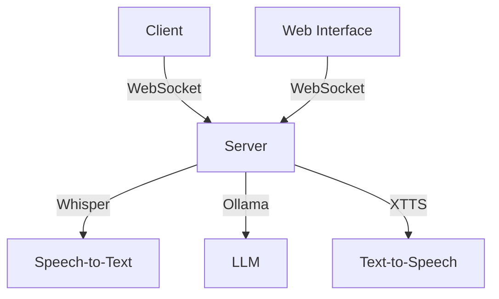
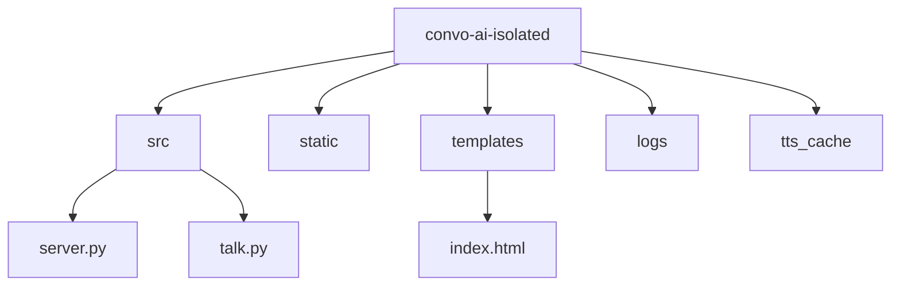
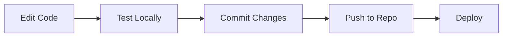

# Convo-AI Isolated - Comprehensive Guide

## 🚀 Quick Start

```bash
# Clone the repository
git clone https://github.com/yourusername/convo-ai-isolated.git
cd convo-ai-isolated

# Install dependencies
pip install -r requirements.txt

# Start the server
python server.py

# In a new terminal, start the client
python talk.py
```

## 📋 Tech Stack



### Core Components
- **Client**: Python-based CLI interface (`talk.py`)
- **Server**: FastAPI-based WebSocket server (`server.py`)
- **Speech-to-Text**: OpenAI's Whisper model
- **LLM**: Ollama (local LLM)
- **Text-to-Speech**: XTTS v2
- **Web Interface**: HTML/JavaScript frontend

## 📁 Project Structure



### Key Files
- `server.py`: Main server application
- `talk.py`: CLI client application
- `templates/index.html`: Web interface
- `config.json`: Configuration file
- `requirements.txt`: Python dependencies

## 🛠️ Installation Guide

### 1. Prerequisites

```bash
# Install Python 3.11 or later
brew install python@3.11  # macOS
sudo apt install python3.11  # Ubuntu/Debian

# Install FFmpeg
brew install ffmpeg  # macOS
sudo apt install ffmpeg  # Ubuntu/Debian
```

### 2. Clone and Setup

```bash
# Clone repository
git clone https://github.com/yourusername/convo-ai-isolated.git
cd convo-ai-isolated

# Create and activate virtual environment
python -m venv venv
source venv/bin/activate  # Linux/macOS
.\venv\Scripts\activate  # Windows

# Install dependencies
pip install -r requirements.txt
```

### 3. Configure Ollama

```bash
# Install Ollama
curl -fsSL https://ollama.com/install.sh | sh

# Pull the LLM model
ollama pull mistral  # or your preferred model
```

### 4. Configure Server

Edit `config.json`:
```json
{
    "model": "mistral",
    "tts_speaker": "p225",
    "tts_speed": 1.0,
    "ws_url": "ws://localhost:8000/ws"
}
```

### 5. Start Services

```bash
# Terminal 1 - Start server
python server.py

# Terminal 2 - Start CLI client
python talk.py

# Terminal 3 - Start web interface (optional)
python -m http.server 8080
```

## 🎮 Usage Guide

### CLI Interface
```bash
# Start recording
Press 'r' to start/stop recording

# Text input mode
Press 't' to switch to text input
Type your message and press Enter

# View history
Press 'h' to view conversation history

# Quit
Press 'q' to exit
```

### Web Interface
1. Open `http://localhost:8080` in your browser
2. Choose between voice or text input
3. Click the microphone icon to record
4. Type your message in text mode
5. Click send to get response

## 🔧 Troubleshooting

### Common Issues

1. **Audio Recording Issues**
```bash
# Check microphone permissions
ls -l /dev/audio*  # Linux
system_profiler SPAudioDataType  # macOS
```

2. **WebSocket Connection Issues**
```bash
# Check if server is running
curl http://localhost:8000/health

# Check WebSocket connection
wscat -c ws://localhost:8000/ws
```

3. **TTS Issues**
```bash
# Clear TTS cache
rm -rf tts_cache/*
```

## 📝 Configuration Options

### Server Configuration (`config.json`)
```json
{
    "model": "mistral",
    "model_settings": {
        "temperature": 0.7,
        "top_p": 0.9,
        "top_k": 40,
        "num_predict": 300
    },
    "tts_speaker": "p225",
    "tts_speed": 1.0,
    "ws_url": "ws://localhost:8000/ws"
}
```

### Client Configuration
- `INPUT_FILE`: "input.wav"
- `RESPONSE_FILE`: "response.wav"
- `VOICE_MODEL`: "tts_models/en/vctk/vits"
- `VOICE_SPEED`: 0.9
- `VOICE_PITCH`: 0.9

## 🔄 Development Workflow



## 📚 Additional Resources

- [FastAPI Documentation](https://fastapi.tiangolo.com/)
- [Whisper Documentation](https://github.com/openai/whisper)
- [Ollama Documentation](https://ollama.ai/docs)
- [XTTS Documentation](https://github.com/coqui-ai/TTS)

## 🤝 Contributing

1. Fork the repository
2. Create a feature branch
3. Commit your changes
4. Push to the branch
5. Create a Pull Request

## 📄 License

This project is licensed under the MIT License - see the [LICENSE](LICENSE) file for details.
